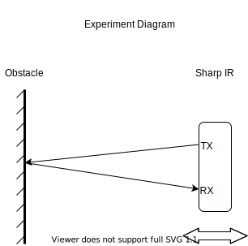

<p align="right">

</p>
     
# Sensor-Curve-Fitting

### Issue
SHARP IR sensor (`GP2Y0A21YK0F`) outputs a raw value which is not linearly correlated with the distance. So, a non-linear function is needed to output the distance from raw value.

The distance measureing characteristics (output) of `GP2Y0A21YK0F` is shown below:
<p align="center">

</p>
Source: <a href="https://global.sharp/products/device/lineup/data/pdf/datasheet/gp2y0a21yk_e.pdf">Datasheet<a>

### Experiment
The experiment is designed with a fixed opaque obstacle, a ruler for distance measurement and the sharp IR sensor. Matlab `Arduino Support Package` and `Curve Fitting Toolbox` was used respectively for Arduino Nano-Matlab connectivity and curve fitting. 

<p align="center">

</p>


- Total 25 distance data of the obstacle and the sensor was recorded from the physical scale to the Matlab input prompt.
- The corresponding sensor raw ADC value was recorded simultaneously.
- `Curve Fitting Toolbox` was used on the recorded ADC value and measured distance following the settings. 
```
Fitting Characteristics= Rational
Numerator degree= 0
Denominator degree= -1
```

<p align="center">

</p>

### Result

```
General model Rat01:
     f(x) = (p1) / (x + q1)
Coefficients (with 95% confidence bounds):
       p1 =        4835  (4723, 4948)
       q1 =      -28.76  (-33.52, -24)

Goodness of fit:
  SSE: 1.701
  R-square: 0.9987
  Adjusted R-square: 0.9986
  RMSE: 0.272
```

<p align="center">

</p>

Derived output function:

<p align="center">

</p>


### Comment

The output function resembles the output characteristics of the sensor within 10-80 cm distance. 
